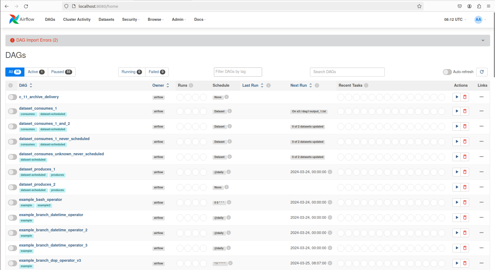
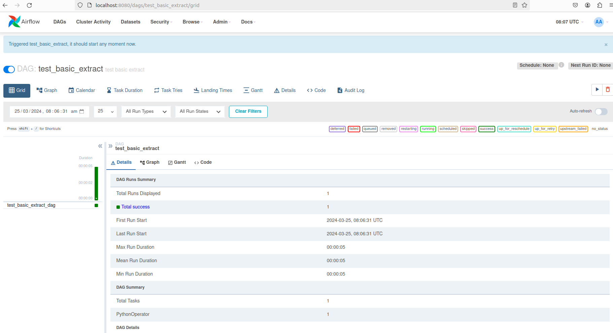

## Primary Image for python requirements: https://github.com/konzainc/konza-kube/blob/main/docker/airflow/Dockerfile
## Virtual Environment image to be used as minimally as possible and may be rejected in code reviews

Testing an Airflow DAG is typically a multi-stage process. What tests will look like for the DAG depend on a number of factors, e.g.:
- nature of the task at hand
- characteristics and size of the data
- requirements re: reproducibility and explainability
- level of project maturity

In mature data pipelines there will typically three levels of testing:
- unit / integration testing for library code
- DAG local testing
- DAG remote testing

## Library code testing

Oftentimes an Airflow data pipeline begins life as a set of disparate Python functions, which Airflow will stitch together. Before writing the Airflow DAG it makes sense to consider writing tests that verify the functionality of various bits of individual code. This is best done using a framework like `pytest`, and does not really involve Airflow itself.

Good, trustworthy DAGs will feature thoroughly unit-tested "business-logic" functions -- it is typically much easier to debug a broken function using a unit test than it is in the context of an Airflow DAG.

Functions that comprise Airflow DAGs will often need to interact with remote databases and APIs. To verify their functionality it is often desirable to write both unit tests (which rely on "mocked" versions of remote services) and integration tests -- more sophisticated tests which rely on functional test-focused replicas of real services.

Good tests need to reproduce production conditions and this often means interacting with realistic data. Developers should take care to produce realistic test cases that nonetheless do not (!) include any PII or PHI. It is thus desirable to use synthetic data generators such as Synthea for instance.

## DAG local testing

A second level of testing involves ascertaining an entire DAG works when run locally. This can be done without the need to run an Airflow scheduler following [this pattern](https://docs.astronomer.io/learn/testing-airflow?tab=decorator#debug-interactively-with-dagtest) when writing a DAG. DAGs written this way can also be run directly using `python [path to DAG]`.

It is important to note that the DAG in this case runs as a single Python process, and its resourcing is limited to whatever resources are available on the local machine. This does mean that a local DAG test may not look the same as a production DAG run. For instance, the local DAG test could use smaller datasets. Developers should be encouraged to use [Airflow Params](https://airflow.apache.org/docs/apache-airflow/stable/core-concepts/params.html) to set up their DAGs, so as to enable the easy execution of local test runs.

## Pre-production Testing

Eventually in the development process a DAG will need to be tested with a scheduler, or with access to production datasets not available locally. To do this, an individualized test deployment of airflow can be accessed via the Konza Jupyterhub service, or can be spun up locally using docker compose (if you have adequate privileges).

### Airflow testing using the Konza Jupyterhub service

Through the Konza Jupyterhub service it is possible to access an individualized deployment of airflow. This deployment of airflow is specific to you: any changes that you make to dags locally will only effect you, any changes you make to airflow settings locally will only effect you. This deployment of airflow runs remotely on the Konza kubernetes cluster, so there is minimal reliance on the performance of your local machine.

To access the Jupyterhub service:
- Navigate to `https://jupyter.konza.org` via your web browser.
- Log in to the Jupyterhub service using your `Azure` account. Access to this service is controlled via OIDC, so if you do not have access contact your local administrator.
- Upon the first login to the service, a persistent volume will be created for you on the kubernetes cluster. Data stored on this persistent volume will be retained if your server is stopped, though could be at risk if the Jupyterhub namespace on the Konza kubernetes deployment is destroyed. It is therefore advisable to back up important files as required.

To access airflow:
- From the launcher, select `Desktop`. This will open a virtual linux desktop in your browser.
- On this virtual desktop, open the web browser via the icon bar at the bottom of the screen.
- Browse to the airflow web server using `localhost:8080`.
- Login to your airflow deployment using the username `airflow`, and the password `airflow`. As this airflow instance is running on your personal Jupyterhub service only you will have access to this account.

To set up airflow:
- Whilst the airflow deployment provided is set up and ready to go, if you want to access any datasets connections have to be set up manually. For external connections you can set these up as you would on the production airflow deployment.
- If you want to develop or test a dag using synthesized data, a test `mariadb` database has been provided through Jupyterhub. Data loaded into this database is persisted at `/home/jovyan/db_data/airflow-mdb` on your Jupyterhub server. To connect to this database establish the following connection:
```
Connection Id: MariaDB
Connection Type: MySQL
Host: 127.0.0.1
Login: root
Password: example
Port: 3306
```

To access DAGs:
This airflow deployment fetches DAGs from `/home/jovyan/konza-dags` on your Jupyterhub server. This directory is a clone of the `konza-dags` repository. If you wish you access dags you have developed locally, you must push them to a branch on this repository (no need to have them merged into `main`), then checkout that branch onto your jupyter server. Once this has been performed you can edit further develop the DAGs through Jupyterhub.
To checkout remote branches from the `konza-dags` repository you must login to your github account on your jupyter server:
- From the launcher, select `Terminal`.
- In the terminal, use `gh auth login`.
- Select to login to a `GitHub.com` account, using `HTTPS`, via a web browser.
- Copy the one-time code, navigate to `https://github.com/login/device` on your local machine, then follow the prompts to complete device activation.
- After this activation, you will be able to interact with the `konza-dags` directory via the command line as a normal github repository.


### Local airflow testing using Docker compose

This is a very effective way to test DAGs by setting up a fully-fledged Airflow server on your local machine. 

A few things to note:
- running airflow locally requires a certain degree of elevated privilege and can be quite resource intensive. If you do not have the permissions to run docker containers or do not have a reasonable powerful machine, it is recommended to use the Jupyterhub service to access airflow. 
- any DAGs that require access to remote services will need to have that access set up using some mechanism. For instance, if you expect to have access to an Azure Blob Storage account using a mount, that mount will need to be available (1) on the machine on which you run `docker compose` and (2) inside the `airflow-worker` image on `docker-compose`.
- local airflow uses the `LocalExecutor`, which different from `KubernetesExecutor`. The local executor will run dags inside of the airflow scheduler container rather than spinning up airflow-worker pods. This may create issues if testing DAGs which rely on tight integration with Kubernetes, e.g. via `PodOverride`, etc. Task execution via `KubernetesOperator` is not affected by this however.
- any tasks using regular `PythonOperator`, `BashOperator`, `PythonVirtualEnvOperator` etc. should work the same way in local testing and remotely.
- this workflow has only been tested on Linux machines, some small changes may be necessary on Windows.

To try out local testing using docker compose:
- Clone this and the (private) `ccd-parse` repos.
- Edit the `.env` file included in this repository to reflect the local location of your `ccd-parse` clone and your local `.xml` files.
- If using the example `.xml` files in the `ccda` directory of the `ccd-parse` repo, you will have to grant airflow read access to this directory, e.g. using `chmod 704` on Linux.
- Install Docker Engine if not already installed (try `docker compose` in cli): https://docs.docker.com/engine/install/ubuntu/
- `cd` into the root of this repository and enter `docker compose up`. `sudo` may be necessary for all docker commands.
- Wait for necessary services to start (can check with `docker container ps -a` for success).
- In the browser type in `http://localhost:8080` to access the airflow web UI.
- Login using username: `airflow`, password: `airflow`.
>>> NOTE: 2 dags currently fail to import: `sftp_board_log_retrieval` and `board_shallow_copy`. This is expected at this stage.

You should see the following image:



- Activate (pressing the toggle button next to the DAG) and run the desired DAG from the UI. `test_basic_extract` is provided as an example for CCD parsing.


- To stop airflow use `docker compose down`.

## Production testing

Both library code and DAG local testing can happen independently of the source control process, and it is to be expected that a developer would run tests many times before reaching code they would like to submit for review. A best-practice level of validation for the functionality of the code submitted in the PR involves running the new (or modified) DAG in an environment that is akin to production, but that is decidedly NOT the production environment into which the developer is trying to merge their code (the purpose of the test being to ascertain the code is ready for production).

DAG remote testing thus allows the developer to test a commit pushed to a github branch in the `konza-dags` repository in an environment that faithfully reproduces production.

This environment is easiest to implement as a replica environment to the airflow production environment, using the source branch for the PR being tested as the source code. Any data artifacts coming out of the environment should be marked as being test (rather than prod) artifacts, since their data lineage will not be trustworthy. [Airflow templates](https://airflow.apache.org/docs/apache-airflow/stable/templates-ref.html) can be used to achieve this requirement.

The replica test environment(s) should be accessible in the same way as the prod environment. Successful DAG runs from a test environment should be appended to DAG PRs as proof the code works as expected -- this can also help trace back why a certain set of modifications to a pipeline was approved if questions arise later on.

An important question is what to do about multiple developers needing to test their code at the same time. In a small organization it is perfectly acceptable to have a single remote environment which developers share (e.g. via an MS Teams channel in which they manually lock and unlock the environment as needed). Switching branch under test in the environment can be done by editing a single environment variable indicating the github branch being pulled in a git-sync container. As the team grows, multiple environments (one per developer) will become necessary, though this will typically require several data engineers actively developing DAGs.

## Maturity cycle for libraries

Developers are free to use operators such as `PythonVirtualEnvOperator` to install or upgrade Python libraries needed for specific code, as long as they are executed against the same base image.

> Note: exceptions from this rule of using the same base image may be acceptable, but only for special and well-argued cases, e.g. needing CUDA bindings for an ML application.

If a library is used often (either in many tasks or in a task that needs to run many times), libraries installed in a `PythonVirtualEnvOperator` should be pushed inside the Docker image.

## To Push Changes, generate PR

To Check which directory you are in : git status
If on correct directory and want to push the changes for an existing Code : git diff (this will show new changes made)
git add <filename> to add the new file
Use : git status to confirm that the new filename is added
git commit -m "commit msg" to add a commit message 
git push to push the changes

If pushing the PR via new directory:
To create new branch : git checkout -b new-branch-name
To push a PR in the new branch : git push origin new-branch-name
